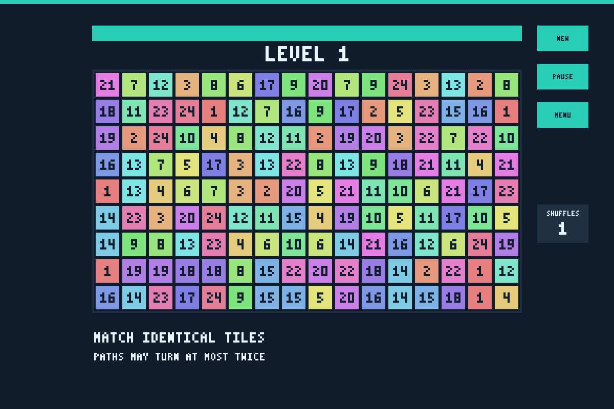

# Pikachu Matching Game — C++ / SDL2

A desktop tile-matching game developed by **Hoang Khai Minh**. It combines grid-based path validation, seven board-shift rules, an SDL2 event loop, and timed gameplay.




## Gameplay

Click two identical tiles to remove them. Their connecting path must be horizontal/vertical, pass only through empty cells, and turn at most twice. The empty border can also form part of a path.

- **9 × 16 playable grid:** 24 tile IDs, each appearing six times.
- **Seven levels:** tiles stay in place, shift down/up/right/left, or move away from/toward the horizontal center after a match.
- **420 seconds per level**, with pause/resume, restart, main menu, and win/loss screens.
- **Automatic reshuffling** when no match remains. One shuffle allowance at the start; one is added for each new level. A negative allowance ends the game. The shuffle count is a display, not a manual-shuffle button.
- **SDL2 rendering and input**, PNG textures via SDL2_image, and WAV effects via SDL2_mixer.

The included demo uses generated numbered tiles and simple backgrounds. Its looping soundtrack is intentionally silent; selection/match/error effects are synthesized tones.

## Technical structure

| Component | Responsibility |
|---|---|
| [game.cpp](game.cpp) | Board generation, path validation, available-move detection, shuffling, gameplay rendering |
| [delete.cpp](delete.cpp) | Seven level-specific removal and shift rules |
| [create_window.cpp](create_window.cpp) | SDL initialization, event handling, menu/game/pause/win/loss state transitions |
| [button.cpp](button.cpp), [menu.cpp](menu.cpp), [sub_menu.cpp](sub_menu.cpp) | Click handling, textures, and menus |
| [timer.cpp](timer.cpp) | Elapsed time and pause/resume accounting |
| [tests/game_tests.cpp](tests/game_tests.cpp) | Path-search comparison, board-rule regressions, and SDL runtime checks |

Path validation intersects reachable row/column intervals to check straight, one-turn, and two-turn connections. Available-move detection searches pairs of occupied tiles; this favors simplicity over performance on the fixed board. Shuffling preserves the remaining tile multiset.

## Build and run

Requires a **C++17 compiler**, **CMake 3.16+**, and development packages for **SDL2**, **SDL2_image**, and **SDL2_mixer**. SDL_ttf and bundled DLLs are not required.

```bash
git clone https://github.com/minhiungan2608/pikachu-matching-game-cpp.git
cd pikachu-matching-game-cpp
cmake -S . -B build -DCMAKE_BUILD_TYPE=Release
cmake --build build --parallel
./build/pikachu
```

Run from the repository root so the relative `data/` paths resolve. With a multi-configuration generator, use `cmake --build build --config Release` and run `build/Release/pikachu.exe` on Windows. If SDL packages are outside the normal search path, supply `-DCMAKE_PREFIX_PATH=<installation-prefix>` when configuring.

On macOS with Homebrew, install dependencies with `brew install cmake sdl2 sdl2_image sdl2_mixer`. On Ubuntu, use `sudo apt-get install cmake g++ libsdl2-dev libsdl2-image-dev libsdl2-mixer-dev`. Windows requires the corresponding SDL2 development packages and a matching compiler/architecture; Windows and macOS builds have not been verified here.

## Verification

```bash
cmake -S . -B build-qa -DCMAKE_BUILD_TYPE=Debug -DENABLE_SANITIZERS=ON
cmake --build build-qa --parallel
ctest --test-dir build-qa --output-on-failure
```

The test executable uses SDL's dummy video/audio drivers. It checks the actual game code against an independent two-turn graph search and independent shift rules, then exercises menu/start/pause/resume/level progression/restart/loss/quit, all seven levels' asset loading, tile counts, shuffling, and timer behavior. AddressSanitizer and UndefinedBehaviorSanitizer are enabled in CI.

See [QA coverage and limitations](docs/QA.md). The screenshot above is a rendered game frame, not a UI mockup. Demo assets can be regenerated with `python3 scripts/generate_demo_assets.py`; no Python packages are required.

## Scope and limitations

This is a local desktop game demonstrating C++ classes, arrays/STL containers, algorithms, resource handling, and event-driven state management. It has fixed resolution, numeric state IDs, raw-pointer ownership, and brute-force available-move search. It has no networking, accounts, persistence, or AI opponent. Reshuffling is capped at 1,000 attempts to avoid an endless retry loop; exhausting that cap ends the game.

Automated headless checks do not replace a full interactive playthrough or verify physical audio output. Full-board solvability is not guaranteed, and the test suite is not exhaustive proof of every possible board state.
